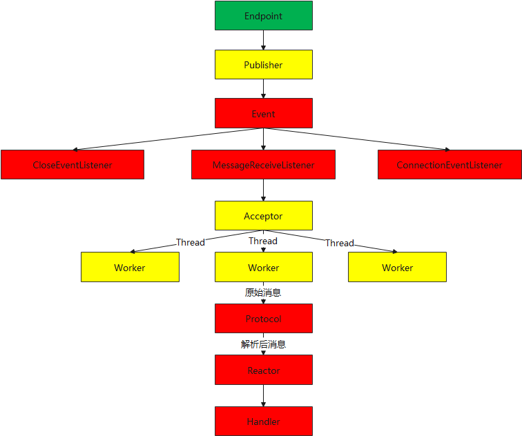
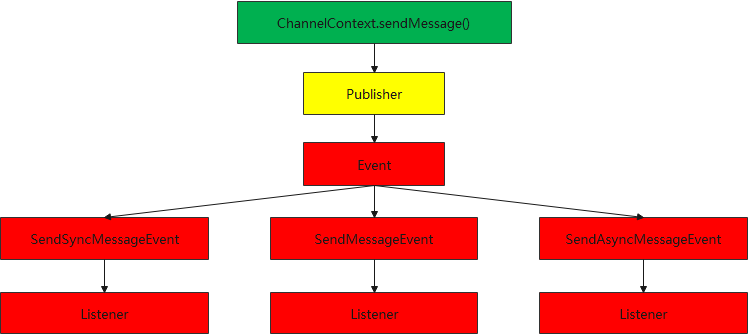

# broheim （布罗海姆）

布罗海姆是一个基于tomcat-websocket-api的二次封装。再原有websocket之上封装了基于心跳检查、断线重连特性。解决了原有websocket网络状况感知不明显的问题。同时也结合SpringBoot的特性封装了spring-boot-starter模块，方便快速集成SpringCloud项目。

# 快速开始


## maven 依赖

在maven依赖中加入依赖项。

```xml
    <dependencies>
        <dependency>
            <groupId>org.broheim</groupId>
            <artifactId>broheim-websocket-core</artifactId>
            <version>1.0-SNAPSHOT</version>
        </dependency>
        <dependency>
            <groupId>org.broheim</groupId>
            <artifactId>broheim-websocket-spring-boot</artifactId>
            <version>1.0-SNAPSHOT</version>
        </dependency>
    </dependencies>
```

为了找到依赖项还需要配置仓库地址

```xml
    <repositories>
        <repository>
            <id>github-broheim-core</id>
            <name>github-broheim-core</name>
            <url>https://raw.github.com/boyalearn/broheim-repository/core</url>
        </repository>
        <repository>
            <id>github-broheim-starter</id>
            <name>github-broheim-starter</name>
            <url>https://raw.github.com/boyalearn/broheim-repository/starter</url>
        </repository>
    </repositories>
```

编写启动类

```java
@SpringBootApplication
@EnableWebSocketServer
public class Application {
    public static void main(String[] args) {
        SpringApplication.run(Application.class, args);
    }
    
    @Bean
    public CommandReactor commandReactor(){
        return new CommandReactor();
    }

    @Component
    @WebSocketController("/ws")
    public static class EndpointController {
        @Command("hello")
        public void doHandle(ChannelContext channelContext, String message) {
            System.out.println(message);
        }
    }
}
```

这样一个服务端程序就已经开发好了。
当客户端发来一个{"cmd":"hello"，"body":"hello world"}消息时。服务端被注解@Command("hello")的方法会处理该消息。

# 核心概念
## Protocol协议 
负责对消息编码解码，以及协议层消息处理逻辑。

## Reactor 消息分发
定义业务上的消息分发规则，将不同的消息分发给不同的Handler

## Handler 消息处理器
Handler与业务相关。将业务上的处理逻辑在handle方法中处理。

# 设计架构

## Endpoint设计架构



## ChannelContext设计架构


